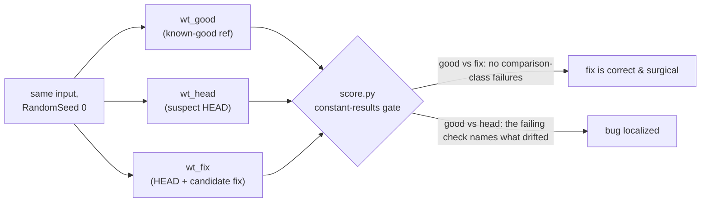

# debugging/ — gRASPA deterministic bug-hunting kit

A self-contained, reproducible toolkit for debugging gRASPA **correctness** (energy/loading
discrepancies, `force_field.def` parser bugs). Built around one invariant: gRASPA is **deterministic
for a fixed `RandomSeed`**, so a correct binary produces **constant (bit-comparable)** results — and
any deviation localizes a bug.

## Contents
| File | What |
|------|------|
| [`TUTORIAL.md`](TUTORIAL.md) | **Start here** — quick step-by-step: run the test case on an agent, or use the playbook on a real bug. |
| [`SKILL.md`](SKILL.md) | **The Claude Code skill** (with frontmatter). Tracked/uploadable copy. |
| [`DEBUGGING.md`](DEBUGGING.md) | The full playbook (tool-agnostic; Codex/human-readable; mirrors SKILL.md). |
| [`REPRODUCE.md`](REPRODUCE.md) | Copy-paste recipe: GPU-free parser repro + full GPU A/B. |
| [`score.py`](score.py) | **Constant-results gate.** Vendored from AutoJIT-gRASPA. `python3 score.py <test> <ref>`. |
| [`selftest.sh`](selftest.sh) | **One-command health check** of the GPU-free kit (repro + grader + `score.py` gotcha). |
| [`sweep_compare.sh`](sweep_compare.sh) | **Pre-merge feature gate.** Sweeps `score.py` over base-vs-feature run dirs against an expected-diff manifest. |
| [`install_skill.sh`](install_skill.sh) | **One-command skill install** for Claude Code (`--user` or `--project`). |
| [`FIELD_TEST.md`](FIELD_TEST.md) | Case study: the new-feature workflow field-tested on a mock `Fugacity` keyword (naive version broke 38/44 inputs; the workflow caught it). |
| [`repro/`](repro/) | Standalone `g++` reproductions of the parser bug (no GPU build). |
| [`test_case/`](test_case/) | **Ready-to-run debugging challenge** for testing another agent (Codex/Claude) — symptom prompt, GPU-free repro, answer key + automated grader. See its `QUICKSTART.md`. |

## Install / share the skill
Anyone with a clone of this repo gets the whole kit — it is self-contained (`score.py` is
vendored). To activate the Claude Code skill:

```bash
bash debugging/install_skill.sh             # user-level (~/.claude/skills/) — all your projects
bash debugging/install_skill.sh --project   # this clone only (<repo>/.claude/skills/)
```

This repo's `.gitignore` excludes `.claude/`, which is why the tracked/shareable copy lives here in
`debugging/SKILL.md` (same pattern AutoJIT-gRASPA uses for its root `SKILL.md`). **Codex** and other
agents need no install — the repo-root `../AGENTS.md` points them at `DEBUGGING.md` automatically.

## Use it on every new feature
Before merging any feature branch, run the **pre-merge gate**: declare which `Examples/` cases the
feature *should* change in a manifest, run the suite on base and feature builds (`RandomSeed 0`,
`2>&1`), then:

```bash
bash debugging/sweep_compare.sh runs_base runs_feat expected_diffs.txt   # exit 0 = surgical
```

Anything `UNEXPECTED-DIFF` is a regression; anything `EXPECTED-MISSING` means the feature didn't do
what it claims. Full workflow: the "Validating a NEW feature" section of
[`SKILL.md`](SKILL.md) / [`DEBUGGING.md`](DEBUGGING.md).

## 60-second start (run from the repo root)
```bash
# Verify the whole GPU-free kit on your machine (repro + grader + score.py; needs g++ & python3):
bash debugging/selftest.sh

# Or just the GPU-free proof of the headline bug:
cd debugging/repro && g++ -O2 -std=c++17 parse_repro2.cpp -o parse_repro2
./parse_repro2 ../../Examples/CO2_NaX_Zeolite/force_field.def   # buggy → Nmixrule=0 ; fixed → 11
```
Full GPU A/B (worktrees + `score.py`): see [`REPRODUCE.md`](REPRODUCE.md).

## The method at a glance
One git worktree + build per suspect version, the **same input with `RandomSeed 0`** in each, and
`score.py` as the judge — gRASPA is deterministic for a fixed seed, so any divergence is a bug:



## Two things that will bite you
1. **stderr** — gRASPA prints its end-of-run energy + loadings to **stderr**. Always run with
   `> output.txt 2>&1`, or `score.py` sees a truncated file and falsely reports "identical."
2. **`score.py` exit code ≠ "runs differ."** It mixes *comparison-vs-reference* checks (moves,
   counts, energies — these mean the runs differ) with *absolute self-checks* (energy drift,
   structure factor — these fire even on a self-compare). Read the JSON `failures` array and judge
   A/B equality by the **absence of comparison-class failures**. (e.g. `CO2_NaX_Zeolite` self-compare
   exits 1 due to an inherent `vdw_hh` drift ≈ 1.65, with zero comparison failures.)

## Attribution
`score.py` is vendored unmodified from **AutoJIT-gRASPA** (https://github.com/Zhaoli2042/AutoJIT-gRASPA),
the JIT/optimization sibling project, whose correctness gate defines "results are constant" for
gRASPA. Bundled here so this debugging workflow runs from this repo alone.
